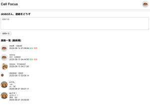
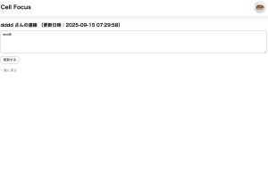

# Cell Focus — 少人数チーム向け 業務連絡専用掲示板

**Cell Focus** は、雑談に埋もれがちな「重要な業務連絡」を分離し、少人数チームのタスク把握を助けるための掲示板アプリです。

---

## 現状の課題
- チーム内の重要な業務連絡が、雑談に埋もれてしまう  
- 指示したタスクをメンバーが見落としてしまうことがある

## 解決手法
- チームの雑談用チャット（例：LINE）とは別に、**業務連絡専用の掲示板**を用意
- 重要連絡はこの掲示板で報告 → 雑談に埋もれず、**タスク管理を補助**

## 想定ユーザー
- 22〜26歳の社会人
- **タスク管理が課題の少人数チーム**

## 想定ユーザー数
- **4〜6人**（少人数チーム）

## 必要な機能
- 会員登録
- 連絡の投稿
- 連絡の編集
- 連絡の削除
- 会員プロフィール設定（ニックネーム／アバター画像）

---

## 使い方
1. ユーザー登録  
2. ログイン  
3. **トップページ**で業務連絡を投稿  
4. **連絡一覧**で、登録ユーザー全員の連絡を確認

---

## その他の仕様
- **編集・削除権限**：投稿主のみが自身の連絡を編集／削除可能
- **アバター設定**：識別性向上のため、各メンバーがアバター画像を設定可能  
  - 変更手順  
    1) 各ページ右上の自身のアイコンをクリック  
    2) 表示された「プロフィール」をクリック  
    3) プロフィールページ下部の「編集する」をクリック  
    4) ニックネーム／アバター画像を変更し「更新する」
- **ログアウト手順**  
  1) 右上の自身のアイコンをクリック  
  2) 「ログアウト」ボタンをクリック
- **詳細ページ**：各連絡の本文はリンクになっており、クリックで**その連絡だけを表示するページ**へ遷移
- **プロフィールへの導線**：各投稿の左に投稿主のアイコンを表示（リンク）→ クリックで**投稿主のプロフィール**へ
- **退会機能**（メンバーの入れ替わりを想定）
  - 手順：  
    1) 右上の自身のアイコン → 「プロフィール」  
    2) 自身のプロフィールページ下部の「退会」ボタンをクリック

---

## 名前の由来（Cell Focus）
- **目的が一発で伝わる**：「少人数チーム × 集中」。雑談から重要連絡を分離するコンセプトを表現
- **B2Bらしい信頼感**：堅めの名刺やLPにも載せやすい名前  
- **“Cell” の語感**：Cell（単位）＝**小さな単位（チーム）ごとに導入**できるイメージに合致

---

## スクリーンショット

**会員登録ページ**

  

   

  
登録内容確認ページ(画像設定しなかった場合)

  

   

  
登録内容確認ページ(画像設定した場合)

  

   

  
会員登録完了ページ

  

   

    
ログインページ

  

   

  
投稿一覧ページ

  

   

  
投稿詳細ページ

  

   

  
投稿編集ページ

  

   

  
プロフィールページ(ログインユーザーのプロフィールページ)

  

   

  
プロフィールページ(ログインユーザー以外のユーザーのプロフィールページ)

  

   

  
プロフィール編集ページ

  

